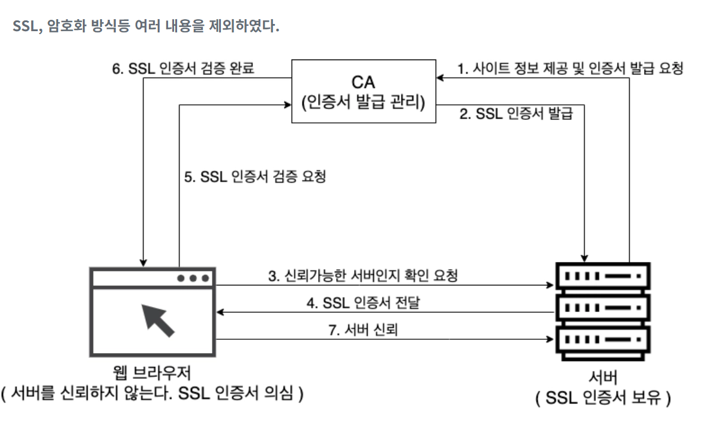

# HTTP와 HTTPS 차이

## HTTP 란?
* HTTP(Hypertext Transfer Protocol)은 서로 다른 시스템들 사이에 통신을 주고 받게 해주는 가장 기본적인 프로토콜이다.
* 웹 서핑을 할 때 서버에서 자신의 브라우저로 데이터를 전송해주는 용도로 많이 사용되며, 서버-클라이언트 모델에 맞춰 데이터를 주고 받기 위한 프로토콜이다.
* 인터넷 초기에 모든 웹 사이트에서 기본적으로 사용되었던 프로토콜이었다.
* 80번 포트를 기본적으로 사용하고 있다.

## HTTPS 란?
* HTTPS는 HTTP에 데이터 암호화가 추가된 프로토콜이다.
* HTTPS는 HTTP와 다르게 443포트를 기본으로 사용하며 네트워크 상에서 제 3자가 정보를 볼 수 없도록 암호화하여 전송한다.
* HTTPS 프로토콜은 SSL(보안 소켓 계층)을 이용해서 HTTP의 보안상 문제를 해결했으며 SSL은 서버와 브라우저 사이에 안전하게 암호화된 연결을 만들 수 있게 도와주고 서버 브라우저가 민감한 정보를 주고 받을 때도 도난당하는 것을 막아준다.

 

---

### 예상 꼬리 질문
* HTTP 와 HTTPS의 동작과정에 대해 설명해 주세요
    * HTTP 
        * 서버 접속 -> 클라이언트 -> 요청 -> 서버 -> 응답 -> 클라이언트 -> 연결 종료
    * HTTPS
        * 1-2. 서버 (사이트): 비대칭키(Server_Public, Server_Private)를 생성한다. 그리고 서버의 각종 정보와 Server_Public 키를 인증기관에 전달하면서 SSL 인증서 생성을 요청한다.

        * 2-6. 인증 기관 (CA): 서버임을 입증하는 정보 (ex. 도메인 주소, 조직, 나라, 유효기간등등)를 담은 SSL 인증서를 발급한다. 그리고 비대칭키(CA_Public, CA_Private)를 생성하고, SSL 인증서를 CA_Private으로 암호화하여 서버에게 전달한다.

        * 7-8. 서버 (사이트): 서버는 CA로부터 받은 인증서 (CA_Private으로 암호화된 인증서)를 게시한다. 클라이언트가 접속 요청을 위한 인증서를 요구하면 인증서를 반환한다.

        * 9-12. 클라이언트 (웹 브라우저): CA_Private으로 암호화된 SSL 인증서를 서버로부터 전달받으면, CA에게 CA_Public 키를 요청한다. 그리고 CA_Public 키로 암호화된 SSL 인증서를 복호화한다. 이때 서버의 정보가 담긴 SSL 인증서와 같이 암호화해둔 Server_Public 키를 얻는다.

        * 13-15. 클라이언트 (웹 브라우저) - 서버 (사이트): 웹 브라우저는 데이터 전송에 사용되는 대칭키를 생성한다. 그리고 획득한 Server_Public으로 대칭키를 암호화하여 서버에 전달한다. 서버는 Server_Private으로 전달받은 암호화된 대칭키를 복호화한다.

        * 16. 클라이언트 (웹 브라우저) - 서버 (사이트): 서로 가지고 있는 대칭키로 데이터를 암호화하고 복호화하며 데이터를 주고받는다.
     
     
     
     
    

---

### 참고 자료
* https://developer-ellen.tistory.com/189
* https://velog.io/@averycode/%EB%84%A4%ED%8A%B8%EC%9B%8C%ED%81%AC-HTTP%EC%99%80-HTTPS-%EB%8F%99%EC%9E%91-%EA%B3%BC%EC%A0%95
* https://mark-kim.blog/HTTPS/

